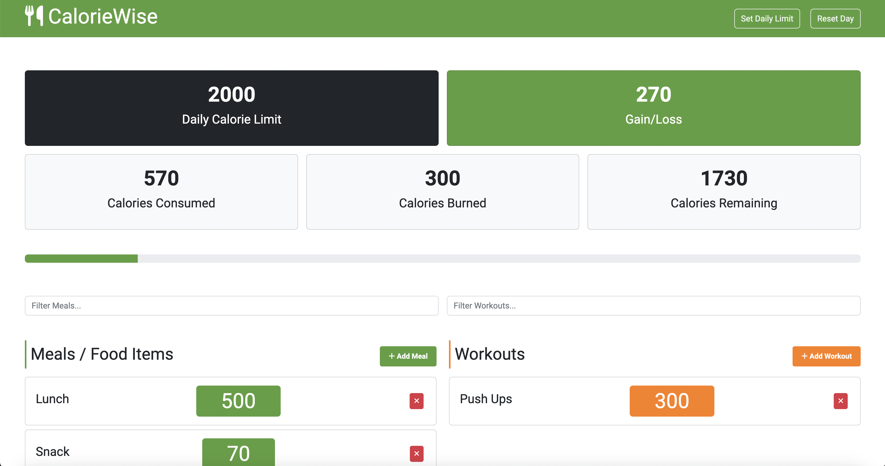

# CalorieWise

CalorieWise is a simple calorie counter app built with vanilla JavaScript. It tracks your meals and workouts and calculates the total calories burned and consumed.

## Features

- Track meals and workouts
- Calculate total calories burned and consumed
- Single-page application design for easy navigation
- Simple and intuitive user interface

## Technologies Used

- HTML
- CSS
- JavaScript

## Usage

- Enter your meals and workouts to track your daily calorie intake and expenditure
- View your total calories burned and consumed to help achieve your fitness goals

## Deployment

This project is deployed on Netlify. You can access it [here](https://github.com/sumbulvohra125/CalorieWise).

## Screenshots
